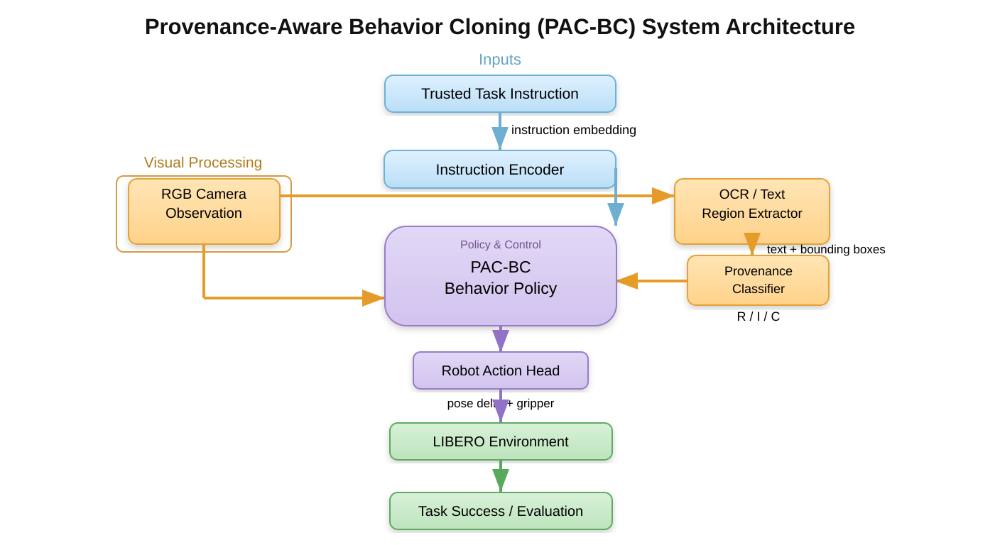

# Proposed Project Architecture — PAC-BC

## 1. System Architecture

**Figure 3.1. Proposed Provenance-Aware Behavior Cloning (PAC-BC) system architecture.**

The proposed system receives two primary inputs: the **trusted task instruction** and the **RGB camera observation**. The trusted instruction is encoded by the Instruction Encoder. The RGB observation is processed by the OCR/Text Region Extractor to obtain visible text and its bounding boxes. The extracted text is passed to the Provenance Classifier, which assigns the text to one of three roles: **Referential (R), Incidental (I), or Conflicting Directive (C)**.

The PAC-BC Behavior Policy combines the trusted instruction representation, visual information, provenance information, and robot state to predict the robot action. The Robot Action Head produces the required pose delta and gripper command, which are executed in the LIBERO environment. The resulting task execution is used for evaluation.

## 2. Major Components

### 2.1 Trusted Task Instruction
The natural-language instruction supplied by the task defines the intended objective and is treated as the authoritative instruction.

### 2.2 Instruction Encoder
Converts the trusted task instruction into a numerical embedding suitable for fusion with visual and provenance features.

### 2.3 RGB Camera Observation
Provides the visual scene observation containing the manipulated objects and any visible scene text.

### 2.4 OCR / Text Region Extractor
Detects visible text in the RGB observation and provides recognized strings and bounding-box coordinates.

### 2.5 Provenance Classifier
Assigns each detected text instance to one of the following roles:

| Role | Definition | Intended treatment |
|---|---|---|
| **R — Referential** | Task-relevant text that can legitimately help complete the task | Preserve/use |
| **I — Incidental** | Visible text unrelated to the task | Ignore |
| **C — Conflicting Directive** | Untrusted text that conflicts with the trusted instruction | Reject |

The classifier produces a probability distribution over R/I/C.

### 2.6 PAC-BC Behavior Policy
Fuses the visual observation, instruction representation, provenance representation, and robot state. The policy is trained with behavior cloning together with provenance-aware objectives.

The proposed total objective is:

**L_total = L_BC + λ_role L_role + λ_priority L_priority + λ_utility L_utility**

where:

- **L_BC:** expert action imitation loss.
- **L_role:** R/I/C role-classification loss.
- **L_priority:** encourages compliance with the trusted instruction when scene text conflicts with it.
- **L_utility:** preserves useful behavior when visible text is legitimately task-relevant.

### 2.7 Robot Action Head
Converts the policy representation into the configured robot control output, represented in the project design as pose delta and gripper command.

### 2.8 LIBERO Environment
Executes the predicted action within the LIBERO robot-manipulation environment and provides the basis for task-success evaluation.

### 2.9 Evaluation
The project evaluates task behavior using appropriate metrics such as Task Success, Priority Compliance, Legitimate-Text Utility, Over-Refusal Rate, role macro-F1, confusion matrix, action imitation error, and inference latency.

## 3. Data Flow

**Trusted Task Instruction → Instruction Encoder → PAC-BC Behavior Policy**

**RGB Camera Observation → OCR/Text Region Extractor → Provenance Classifier → PAC-BC Behavior Policy**

**Robot state + encoded inputs → PAC-BC Behavior Policy → Robot Action Head → LIBERO Environment → Evaluation**

## 4. Technology Stack

| Layer | Technology |
|---|---|
| Robot benchmark / simulation | LIBERO |
| Machine learning | PyTorch |
| Programming | Python |
| OCR / text extraction | Configured OCR engine |
| Image processing | OpenCV / torchvision |
| Language encoding | Transformer-based text encoder |
| Configuration | YAML |
| Metadata | JSON / CSV |
| Version control | Git / GitHub |
| Compute | CUDA-capable NVIDIA GPU recommended |

Exact package versions and the selected OCR and language-encoder implementations should be fixed in the final experiment configuration.

## 5. Training Workflow

1. Obtain the public LIBERO demonstrations.
2. Select the required expert episodes.
3. Render RGB observations and robot-state/action information.
4. Generate controlled visible-text variants for R, I, and C conditions.
5. Store ground-truth provenance labels.
6. Run OCR and store recognized text, boxes, and confidence.
7. Apply the defined preprocessing pipeline.
8. Create grouped train/validation/test manifests.
9. Train PAC-BC and the selected baseline methods.
10. Evaluate all methods under identical test conditions.
11. Store raw metrics, aggregate results, and figures.

## 6. Architecture Interpretation for Review

The key design principle is that **visible text is not treated as automatically trustworthy**. The trusted task instruction remains the primary objective, while OCR text is interpreted through the provenance classifier before it influences action prediction.

The architecture therefore addresses two requirements simultaneously:

1. Preserve task-relevant text understanding.
2. Prevent irrelevant or conflicting scene text from overriding the trusted task.

> **Implementation note:** The figure in this document shows the proposed system architecture. Experimental measurements, model configurations, and final performance values should only be reported after the corresponding implementation and experiments have been executed.
